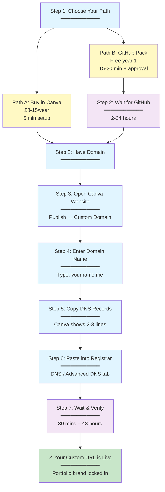

# Own Your Portfolio URL

**A HAC × HHM Cameo Guide** — Take control of your portfolio link in 10 minutes.

---

## Why This Matters

Right now, most students share Canva links like `yourname.my.canva.site`. It works, but it looks like a template, not a brand.

In 10 minutes, you can have `yourname.me` or `yourname.tech` pointing to your Canva site instead.

**Your portfolio URL is part of your brand. Own it.**

This isn't about being perfect. It's about being **intentional**.

---

## By the End of Today, You'll Know

- What a custom domain is (and why it matters for recruiter first impressions)
- The 2 main ways to get one as a student (free vs. paid)
- Realistic timelines for each path
- The exact steps to connect it to your Canva website
- Common pitfalls and how to avoid them
- How to use AI to troubleshoot if you get stuck

---

## What You Already Have (Prerequisites)

✓ A Canva Pro account (marketing students have this)  
✓ A Canva website or landing page draft  

**What you need to set up:**  
→ One custom domain (your own address on the internet)  
→ Either buy it directly through Canva, or get it free for 1 year via GitHub's Student Developer Pack

---

## Mental Model (No Tech Jargon)

Your Canva site is the **house**.  
Your domain is the **street address**.  

We're just telling the internet: *"When someone types this address, send them to my Canva house."*

That's all DNS is. Address forwarding.

---

## Path A – Buy Inside Canva (Simplest, Paid)

**Timeline: 5 minutes setup + live immediately**

### Steps

1. In Canva, go to: **Websites → Publish website → Use a custom domain**
2. Use Canva's search to find something like `yourname.me` or `yourname.studio`
3. Purchase the domain through Canva's flow (card payment required)
4. Canva links it for you automatically — no DNS records to manually paste
5. Your site is live within minutes

### Cost & Best For

- **Cost:** £8–15/year depending on TLD
- **Best for:** Students who want zero friction and don't mind paying
- **Friction level:** Lowest — Canva handles everything
- **Time to live:** Immediate after purchase

### Why Choose This Path

- No separate registrar account to manage
- No DNS settings to configure
- No waiting for GitHub approval
- Browser cache automatically clears on Canva's side

### Caveats

- You're reliant on Canva for domain management
- If you want to move the domain elsewhere later, you'll need to transfer it out (usually possible but requires extra steps)
- Annual renewal reminder is your responsibility — set a calendar alert

---

## Path B – Free Domain for 1 Year (Student Hacker Route)

**Timeline: 15–20 minutes setup + 2–24 hours for GitHub approval + 30 mins–48 hrs to propagate**

### Steps

1. Go to **GitHub Student Developer Pack**: https://education.github.com/pack
2. Sign up or log in with your **student email** (this is the fastest verification method)
3. Click **"Get your pack"** and upload your student ID (must show your name, school, and enrollment year)
4. If your student ID has no expiry date, GitHub may ask for a supporting document (transcript, enrollment certificate, or class schedule from your institution's portal)
5. Wait for approval (usually 2–24 hours)
6. Once approved, navigate to the domain partners section and claim the **Namecheap** or **Name.com** offer
7. Search for your domain (usually `.me`, `.tech`, `.name` available free for year one)
8. During checkout, the promo code applies **automatically** — don't edit it
9. Create your registrar account and complete signup (£0 for first year)

### Cost & Best For

- **Year 1 cost:** Free (then ~£8–15/year renewal)
- **Best for:** Budget-conscious students who don't mind extra steps
- **Friction level:** Moderate — requires GitHub approval wait
- **Time to live:** 2–24 hours (GitHub approval) + 30 mins–48 hrs (DNS propagation)

### Why Choose This Path

- Free for the first year (covers your entire portfolio project timeline)
- You own the domain — stored at an independent registrar
- You learn how DNS actually works
- GitHub Student Pack includes other free tools (15+ others)
- You can easily move the domain to another registrar later if needed

### Caveats

- **GitHub approval isn't guaranteed** — make sure your school email is recognized or upload a clear student ID
- **Waiting period** — budget 24 hours for approval (plan ahead)
- **WHOIS registration** — Namecheap will ask for your personal mailing address during signup. By default, this is public. **Solution:** Namecheap includes **WhoisGuard privacy protection for free** — activate it during checkout to keep your address private
- **DNS propagation isn't instant** — can take up to 48 hours for the internet to recognize your domain everywhere (usually 30 mins)
- **Year 2 renewal** — you'll need to pay (or find another free domain). Set a calendar reminder now
- **Avoid wildcard DNS records** — if you later add DNS records yourself, never use `*.example.com` format. This creates security vulnerabilities where someone could take over subdomains. Use specific records only (e.g., `@` for root, `www` for www)

---

## Quick Comparison

| | **Path A (Canva)** | **Path B (GitHub + Namecheap)** |
|---|---|---|
| **Cost** | £8–15/year | Free year 1, then ~£8–15/year |
| **Setup time** | 5 min | 15–20 min |
| **Approval wait** | None (immediate) | 2–24 hours (GitHub approval) |
| **Time to live** | Immediate | 30 mins–48 hours |
| **Friction level** | Lowest | Moderate |
| **DNS setup** | Handled by Canva | Manual copy-paste (but simple) |
| **Registrar account** | Not needed | Yes (Namecheap or Name.com) |
| **WHOIS privacy** | Included | Free (WhoisGuard) — must activate |
| **Best for** | "Just get it done" students | Budget-conscious students |

---

## Connecting Any Domain to Canva

**Core principle:** You're setting up DNS records to tell the internet: *"This domain name points to my Canva website."*

You can set up or update certain DNS records and your project settings to point the default domain for your Canva website to a custom domain.

### Step 1 – Start from Canva

1. Open your website in Canva
2. Click **Publish website → Use a custom domain → Use my own domain**
3. Type your domain name (without `https://` or `www`): e.g. `yourname.me`

### Step 2 – Tell Canva Where Your Domain Lives

- **If you bought it in Canva (Path A):** Choose the Canva option and follow the prompts (mostly automatic)
- **If you bought it elsewhere (Path B - Namecheap, Name.com, etc.):** Choose **"I bought it somewhere else"**

### Step 3 – Copy-Paste the Forwarding Instructions

1. Canva will show you **2–3 lines of settings** to add at your domain provider:
   - A **"verify ownership" line (TXT record)** — proves to Canva that you actually own the domain
   - **One or two "point this address to Canva" lines (A or CNAME records)** — tell the internet where your site lives
2. At your domain provider, go to **DNS settings** or **Advanced DNS tab**:
   - **For Namecheap:** Dashboard → Manage domain → **Advanced DNS** tab
   - **For Name.com:** My Domains → **Manage DNS**
3. Copy-paste each record exactly as Canva shows it (character-for-character)
4. Save the changes
5. Return to Canva and click **"I've added these"** and publish

### Step 4 – Wait & Verify

- **Propagation time:** Usually 30 minutes, but can take up to 48 hours for global internet propagation
- **Check progress:** Use https://dnschecker.org — paste your domain and look for green checkmarks
- **If it's not working after 30 mins:** Check that you copied the DNS records exactly (including any dots or underscores)

### What's Actually Happening

You're telling the internet's address book: *"When someone types `yourname.me`, route them to Canva's servers."*

DNS records are just permanent forwarding instructions. No magic.

---

## Common Pitfalls & Solutions

### Browser Cache Issues

**Problem:** You've connected your domain but your browser still shows the old Canva URL.

**Solution:** Clear your browser's cache. Your browser cached the old forwarding and needs a fresh look:
- **Chrome:** Settings → Privacy and security → Clear browsing data → select "All time" and "Cached images and files" → Clear data
- **Safari:** Develop → Empty Web Caches (or manually clear History → Clear History)
- **Firefox:** Settings → Privacy & Security → Clear Data

This is especially important if you tested the domain before connecting it to Canva.

### Domain Name Taken

**Problem:** You try to use a custom domain but Canva says it's already in use.

**Solution:** You need to **verify the domain first** at Canva. This ties the domain to your Canva account and prevents someone else from using it. Canva will walk you through domain verification as part of the connection flow. It usually requires adding a TXT verification record (same process as Step 3 above).

### DNS Records Still Show as "Pending"

**Problem:** You added the DNS records but Canva still shows them as pending after 30 mins.

**Solutions:**
1. **Wait longer** — DNS can take up to 48 hours globally
2. **Double-check your copy-paste** — even one character off breaks it. Verify each record matches exactly
3. **Check your registrar saved the records** — go back to Namecheap/Name.com and confirm the records were actually saved (not just entered)
4. **TTL settings** — if your registrar has a TTL (Time To Live) setting, make sure it's not set to a very high number (24 hours is standard)

### WHOIS Privacy (Path B Only)

**Problem:** Your personal mailing address is publicly visible when someone looks up your domain.

**Solution:** 
- During Namecheap checkout, **activate WhoisGuard** (it's free with your education discount)
- WhoisGuard replaces your personal address with Namecheap's address in the public registry
- Once activated, your address is private and protected

**Why this matters:** Domain privacy prevents spam and unsolicited contact at your mailing address.

### Wildcard DNS Records (Advanced — Avoid This)

**Problem:** You might see wildcard records like `*.example.com` suggested somewhere.

**Solution:** **Never use wildcard DNS records.** They create immediate security vulnerabilities:
- If you verify `example.com`, it prevents takeover of `a.example.com`
- But a wildcard record `*.example.com` is still exposed, meaning someone could take over `b.a.example.com`

**Rule:** Use specific records only (e.g., `@` for root, `www` for www). Ask your registrar or use the AI prompt below if you're unsure.

---

## Process Flow (Visual Reference)

---

## Detailed Reference: Domain Providers

### If You Used Path A (Canva Domain)

- **Where to manage DNS:** Inside Canva (no separate registrar account)
- **What you do:** Canva handles everything
- **Browser cache:** May need clearing if domain was tested before connecting

### If You Used Path B (GitHub Pack → Namecheap)

1. Go to: https://www.namecheap.com → Sign in with your account
2. Navigate to: **Dashboard → My Domains**
3. Find your domain and click **Manage**
4. Click the **Advanced DNS** tab
5. Paste each record Canva provided into the table:
   - **Type:** Copy from Canva (TXT, A, or CNAME)
   - **Host:** Copy from Canva (usually `@` or `_canva-challenge-yourname`)
   - **Value:** Copy from Canva exactly
   - **TTL:** Leave as default (3600 is standard)
6. Click **Save all changes**
7. Return to Canva and click **"I've added these"** → **Publish**

### If You Used Path B (GitHub Pack → Name.com)

1. Go to: https://www.name.com → Sign in with your account
2. Navigate to: **My Domains → [Your Domain] → Manage DNS**
3. Click **Add DNS Record** or **Edit** for each record Canva provided
4. Paste values exactly as shown by Canva
5. Save each record
6. Return to Canva and click **"I've added these"** → **Publish**

---

## Troubleshooting: Copy-Paste AI Prompt (One-Shot Context)

If you get stuck at any point, open **ChatGPT**, **Claude**, or **Perplexity** and paste this prompt with your details filled in. The AI will act as a non-technical guide and ask clarifying questions if needed.

---

> **I'm a marketing student at a university setting up a custom domain for my Canva portfolio website. I'm following a HAC × HHM guide created for non-technical students.**
>
> **My current situation:**
> - My domain name is: **[YOUR DOMAIN HERE]** (e.g., yourname.me)
> - I bought it from: **[CANVA / NAMECHEAP / NAME.COM / OTHER REGISTRAR]**
> - I have a Canva Pro account with a published website
> - I'm currently at this step: **[WHICH STEP: 1-7 FROM THE GUIDE]** (e.g., "I've copied the DNS records from Canva, now I need to paste them into Namecheap")
>
> **Important context for your response:**
> - I'm NOT a tech person — explain like I'm non-technical
> - Tell me **exactly** what to click in Canva, my registrar, and what buttons to look for
> - When you mention DNS records, treat them as "lines I copy-paste" — don't use jargon
> - Tell me what to expect (e.g., "it will take 30 minutes to work globally")
> - If you need more info from me, ask me directly (e.g., "Do you see a TXT record or an A record?")
> - Keep answers short and numbered so I can follow them **during a live event or workshop**
> - Include common gotchas (e.g., "clear your browser cache if it still shows the old link")
>
> **Official Canva guides I'm using:**
> - Domain search: https://www.canva.com/domains/search?query=
> - Buying a domain: https://www.canva.com/en/design-school/resources/purchase-a-new-domain-name
> - Using your own domain: https://www.canva.com/en_gb/help/publishing-websites-own-domains/
>
> **Where am I stuck?** Describe what you see on your screen right now, or what error message (if any).

---

## Key Takeaways

**You don't need to be "technical" to own your link.** You just need:

1. A Canva site ✓
2. A domain (free via GitHub or paid via Canva) ✓
3. A guide you can copy-paste into an AI when stuck ✓
4. 30 minutes to an hour of your time (plus waiting for propagation)

**Your portfolio URL is part of your brand. Own it.**

Not perfect. Just **intentional**.

---

## Resources

- **GitHub Student Developer Pack:** https://education.github.com/pack
- **Canva Domain Search:** https://www.canva.com/domains/search?query=
- **Canva Domain Buying Guide:** https://www.canva.com/en/design-school/resources/purchase-a-new-domain-name
- **Canva Custom Domain Help:** https://www.canva.com/en_gb/help/publishing-websites-own-domains/
- **Namecheap Dashboard:** https://www.namecheap.com
- **Name.com Dashboard:** https://www.name.com
- **DNS Propagation Checker:** https://dnschecker.org
- **Browser Cache Clear Guide:** Your browser's help menu or DevTools

---

## About This Guide

**Created by:** HAC (Hospitality & Entrepreneurship Club × AI Collective) as a cameo for **HHM Portfolio Night** — 30 March 2026.

**For:** Non-technical marketing students who want their portfolio to look intentional, not templated.

**Why we built this:** Because owning your URL is the easiest way to stand out. It takes 10 minutes and costs either £0 or £10. No excuse not to do it.

**Questions?** DM @kartavya.tech or drop in the HAC chat.

Not perfect. Just intentional. 💋

---

## FAQ (Extras)

**Q: Can I use a .com domain?**  
A: Yes — Canva sells .com domains (Path A), but they cost more (~£12/year). GitHub Student Pack usually offers free .me, .tech, or .name. Go with what's free first.

**Q: What if I don't have a student ID?**  
A: GitHub can auto-verify via your school email. Make sure you're using your actual school email (e.g., yourname@hult.edu) during signup.

**Q: Can I transfer the domain later?**  
A: Yes — both Canva and Namecheap allow transfers, but it takes extra steps. Don't worry about it now; you can always move later if needed.

**Q: What happens after year 1 if I used the free GitHub domain?**  
A: Namecheap will email you about renewal. You can either pay (usually ~£8/year), or claim another free domain from GitHub's Student Pack. Set a calendar reminder for month 11 so you don't forget.

**Q: Do I need to do anything special for CNAME vs. A records?**  
A: No — just copy-paste exactly what Canva shows you. The registrar knows what to do with each type.
